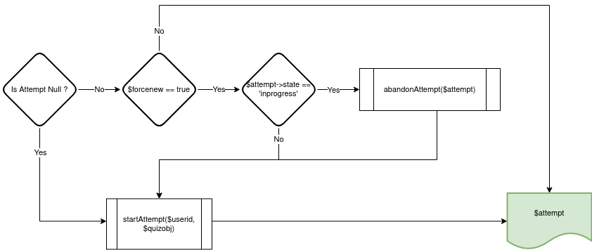

# local_headlessquiz
The primary purpose of this plugin is to facilitate running quizzes on Moodle in 'headless' mode i.e. via webservice calls.

Previously, up to 6 webservice calls were required to just start a single quiz attempt, making this quite difficult. This plugin combines this functionality into a single call, streamlining the process.

## Usage
There is no interface to this plugin, it is interacted with purely via webservices. 

1. Create a quiz via the Moodle interface (see Limitations below)
2. Get the course module ID (from the URL query parameters) 
3. The headless quiz function is attached to the `moodle_mobile_app` webservice, so ensure that it is enabled.
4. Call the webservice: `/webservice/rest/server.php?wstoken=[TOKEN]&wsfunction=local_headlessquiz_get_attempt&cmid=[CMID]&moodlewsrestformat=json` (replacing variables in brackets where necessary)


<details>
<summary><b>Example response from webservice function</b></summary>

```json
{
	"data": {
		"user": {
			"id": 18
		},
		"quiz": {
			"id": 1,
			"name": "Headless Quiz Test 1",
			"cmid": 66,
			"gradetopass": 5,
			"bestgrade": 10,
			"questions": [
				{
					"id": 11,
					"name": "True or false 1",
					"questiontext": "<p dir=\"ltr\" style=\"text-align: left;\">Is this question true? Select True<br><\/p>",
					"type": "truefalse",
					"slot": 1,
					"options": "{\"id\":\"6\",\"question\":\"11\",\"trueanswer\":\"21\",\"falseanswer\":\"22\",\"answers\":{\"21\":{\"id\":\"21\",\"question\":\"11\",\"answer\":\"True\",\"answerformat\":\"0\",\"fraction\":\"1.0000000\",\"feedback\":\"<p dir=\\\"ltr\\\" style=\\\"text-align: left;\\\">Feed back for true test<br><\\\/p>\",\"feedbackformat\":\"1\"},\"22\":{\"id\":\"22\",\"question\":\"11\",\"answer\":\"False\",\"answerformat\":\"0\",\"fraction\":\"0.0000000\",\"feedback\":\"<p dir=\\\"ltr\\\" style=\\\"text-align: left;\\\"><\\\/p><p dir=\\\"ltr\\\">Feed back for false test<br><\\\/p><br><p><\\\/p>\",\"feedbackformat\":\"1\"}}}"
				},
				{
					"id": 12,
					"name": "multiple choice test 1",
					"questiontext": "<p dir=\"ltr\" style=\"text-align: left;\">multiple choice test 1<br><\/p>",
					"type": "multichoice",
					"slot": 2,
					"options": "{\"id\":\"3\",\"questionid\":\"12\",\"layout\":\"0\",\"single\":\"1\",\"shuffleanswers\":\"1\",\"correctfeedback\":\"Your answer is correct.\",\"correctfeedbackformat\":\"1\",\"partiallycorrectfeedback\":\"Your answer is partially correct.\",\"partiallycorrectfeedbackformat\":\"1\",\"incorrectfeedback\":\"Your answer is incorrect.\",\"incorrectfeedbackformat\":\"1\",\"answernumbering\":\"abc\",\"shownumcorrect\":\"1\",\"showstandardinstruction\":\"0\",\"answers\":{\"23\":{\"id\":\"23\",\"question\":\"12\",\"answer\":\"<p dir=\\\"ltr\\\" style=\\\"text-align: left;\\\">C1<br><\\\/p>\",\"answerformat\":\"1\",\"fraction\":\"1.0000000\",\"feedback\":\"<p dir=\\\"ltr\\\" style=\\\"text-align: left;\\\">C1 feedback here<br><\\\/p>\",\"feedbackformat\":\"1\"},\"24\":{\"id\":\"24\",\"question\":\"12\",\"answer\":\"<p dir=\\\"ltr\\\" style=\\\"text-align: left;\\\">C2<br><\\\/p>\",\"answerformat\":\"1\",\"fraction\":\"0.9000000\",\"feedback\":\"<strong>C2 feedback<br><\\\/strong>\",\"feedbackformat\":\"1\"},\"25\":{\"id\":\"25\",\"question\":\"12\",\"answer\":\"<p dir=\\\"ltr\\\" style=\\\"text-align: left;\\\">C3<br><\\\/p>\",\"answerformat\":\"1\",\"fraction\":\"0.1111111\",\"feedback\":\"<p dir=\\\"ltr\\\" style=\\\"text-align: left;\\\"><em>C3 feddback<br><\\\/em><\\\/p>\",\"feedbackformat\":\"1\"},\"26\":{\"id\":\"26\",\"question\":\"12\",\"answer\":\"<p dir=\\\"ltr\\\" style=\\\"text-align: left;\\\">C4<br><\\\/p>\",\"answerformat\":\"1\",\"fraction\":\"0.2500000\",\"feedback\":\"<h3 dir=\\\"ltr\\\" style=\\\"text-align: left;\\\">C4 feedback<br><\\\/h3>\",\"feedbackformat\":\"1\"}}}"
				},
				{
					"id": 5,
					"name": "Test3",
					"questiontext": "<p dir=\"ltr\" style=\"text-align: left;\">test<br><\/p>",
					"type": "multichoice",
					"slot": 3,
					"options": "{\"id\":\"2\",\"questionid\":\"5\",\"layout\":\"0\",\"single\":\"0\",\"shuffleanswers\":\"1\",\"correctfeedback\":\"Your answer is correct.\",\"correctfeedbackformat\":\"1\",\"partiallycorrectfeedback\":\"Your answer is partially correct.\",\"partiallycorrectfeedbackformat\":\"1\",\"incorrectfeedback\":\"Your answer is incorrect.\",\"incorrectfeedbackformat\":\"1\",\"answernumbering\":\"abc\",\"shownumcorrect\":\"1\",\"showstandardinstruction\":\"0\",\"answers\":{\"11\":{\"id\":\"11\",\"question\":\"5\",\"answer\":\"<p dir=\\\"ltr\\\" style=\\\"text-align: left;\\\">test<br><\\\/p>\",\"answerformat\":\"1\",\"fraction\":\"0.9000000\",\"feedback\":\"\",\"feedbackformat\":\"1\"},\"12\":{\"id\":\"12\",\"question\":\"5\",\"answer\":\"<p dir=\\\"ltr\\\" style=\\\"text-align: left;\\\">test<br><\\\/p>\",\"answerformat\":\"1\",\"fraction\":\"0.1000000\",\"feedback\":\"\",\"feedbackformat\":\"1\"},\"13\":{\"id\":\"13\",\"question\":\"5\",\"answer\":\"<p dir=\\\"ltr\\\" style=\\\"text-align: left;\\\">test<br><\\\/p>\",\"answerformat\":\"1\",\"fraction\":\"0.0000000\",\"feedback\":\"\",\"feedbackformat\":\"1\"},\"14\":{\"id\":\"14\",\"question\":\"5\",\"answer\":\"<p dir=\\\"ltr\\\" style=\\\"text-align: left;\\\">wrong<br><\\\/p>\",\"answerformat\":\"1\",\"fraction\":\"0.0000000\",\"feedback\":\"\",\"feedbackformat\":\"1\"}}}"
				},
				{
					"id": 4,
					"name": "Short answer",
					"questiontext": "<p dir=\"ltr\" style=\"text-align: left;\">Short answer<br><\/p>",
					"type": "shortanswer",
					"slot": 4,
					"options": "{\"usecase\":\"0\",\"answers\":{\"9\":{\"id\":\"9\",\"question\":\"4\",\"answer\":\"correct\",\"answerformat\":\"0\",\"fraction\":\"1.0000000\",\"feedback\":\"\",\"feedbackformat\":\"1\"},\"10\":{\"id\":\"10\",\"question\":\"4\",\"answer\":\"incorrect\",\"answerformat\":\"0\",\"fraction\":\"0.5000000\",\"feedback\":\"\",\"feedbackformat\":\"1\"}}}"
				}
			]
		},
		"attempt": {
			"id": 77,
			"state": "inprogress",
			"feedback": "",
			"summarks": 0,
			"passed": false,
			"scaledgrade": 0,
			"timestart": 1667178056,
			"timemodified": 1667179192,
			"number": 64,
			"responses": [
				{
					"questionid": 11,
					"state": "gradedright",
					"mark": 1,
					"status": "Correct",
					"data": "{\"answer\":\"1\"}",
					"slot": 1,
					"html": "<div id=\"question-77-1\" class=\"que truefalse immediatefeedback correct\"><div class=\"info\"><h3 class=\"no\">Question <span class=\"qno\">1<\/span><\/h3><div class=\"state\">Correct<\/div><div class=\"grade\">Mark 1.00 out of 1.00<\/div><div class=\"questionflag editable\"><input type=\"hidden\" name=\"q77:1_:flagged\" value=\"0\" \/><input type=\"hidden\" value=\"qaid=273&amp;qubaid=77&amp;qid=11&amp;slot=1&amp;checksum=e1e20dd938322a7e95f3f5894c60ba08&amp;sesskey=DESmM0G03Y&amp;newstate=\" class=\"questionflagpostdata\" \/><input type=\"checkbox\" id=\"q77:1_:flaggedcheckbox\" name=\"q77:1_:flagged\" value=\"1\" \/><label id=\"q77:1_:flaggedlabel\" for=\"q77:1_:flaggedcheckbox\"><span>Flag question<\/span><\/label>\n<\/div><\/div><div class=\"content\"><div class=\"formulation clearfix\"><h4 class=\"accesshide\">Question text<\/h4><input type=\"hidden\" name=\"q77:1_:sequencecheck\" value=\"2\" \/><div class=\"qtext\"><p dir=\"ltr\" style=\"text-align: left;\">Is this question true? Select True<br><\/p><\/div><div class=\"ablock\"><div class=\"prompt\">Select one:<\/div><div class=\"answer\"><div class=\"r0 correct\"><input type=\"radio\" name=\"q77:1_answer\" value=\"1\" id=\"q77:1_answertrue\" disabled=\"disabled\" checked=\"checked\" \/><label for=\"q77:1_answertrue\" class=\"ml-1\">True<\/label> <i class=\"icon fa fa-check text-success fa-fw \"  title=\"Correct\" role=\"img\" aria-label=\"Correct\"><\/i><\/div><div class=\"r1\"><input type=\"radio\" name=\"q77:1_answer\" value=\"0\" id=\"q77:1_answerfalse\" disabled=\"disabled\" \/><label for=\"q77:1_answerfalse\" class=\"ml-1\">False<\/label> <\/div><\/div><\/div><\/div><div class=\"outcome clearfix\"><h4 class=\"accesshide\">Feedback<\/h4><div class=\"feedback\"><div class=\"specificfeedback\"><p dir=\"ltr\" style=\"text-align: left;\">Feed back for true test<br><\/p><\/div><div class=\"generalfeedback\"><p dir=\"ltr\" style=\"text-align: left;\">General feedback here<br><\/p><\/div><div class=\"rightanswer\">The correct answer is 'True'.<\/div><\/div><\/div><\/div><\/div>",
					"sequencecheck": 2,
					"feedback": "<div class=\"specificfeedback\"><p dir=\"ltr\" style=\"text-align: left;\">Feed back for true test<br><\/p><\/div><div class=\"generalfeedback\"><p dir=\"ltr\" style=\"text-align: left;\">General feedback here<br><\/p><\/div><div class=\"rightanswer\">The correct answer is 'True'.<\/div>"
				},
				{
					"questionid": 12,
					"state": "gradedpartial",
					"mark": 0.56000000000000005,
					"status": "Partially correct",
					"data": "{\"answer\":\"1\"}",
					"slot": 2,
					"html": "<div id=\"question-77-2\" class=\"que multichoice immediatefeedback partiallycorrect\"><div class=\"info\"><h3 class=\"no\">Question <span class=\"qno\">2<\/span><\/h3><div class=\"state\">Partially correct<\/div><div class=\"grade\">Mark 0.56 out of 5.00<\/div><div class=\"questionflag editable\"><input type=\"hidden\" name=\"q77:2_:flagged\" value=\"0\" \/><input type=\"hidden\" value=\"qaid=274&amp;qubaid=77&amp;qid=12&amp;slot=2&amp;checksum=78c3bed6d558d9350d71c9ffbda50618&amp;sesskey=DESmM0G03Y&amp;newstate=\" class=\"questionflagpostdata\" \/><input type=\"checkbox\" id=\"q77:2_:flaggedcheckbox\" name=\"q77:2_:flagged\" value=\"1\" \/><label id=\"q77:2_:flaggedlabel\" for=\"q77:2_:flaggedcheckbox\"><span>Flag question<\/span><\/label>\n<\/div><\/div><div class=\"content\"><div class=\"formulation clearfix\"><h4 class=\"accesshide\">Question text<\/h4><input type=\"hidden\" name=\"q77:2_:sequencecheck\" value=\"2\" \/><div class=\"qtext\"><p dir=\"ltr\" style=\"text-align: left;\">multiple choice test 1<br><\/p><\/div><div class=\"ablock no-overflow visual-scroll-x\"><div class=\"answer\"><div class=\"r0\"><input type=\"radio\" name=\"q77:2_answer\" disabled=\"disabled\" value=\"0\" id=\"q77:2_answer0\" aria-labelledby=\"q77:2_answer0_label\" \/><div class=\"d-flex w-auto\" id=\"q77:2_answer0_label\" data-region=\"answer-label\"><span class=\"answernumber\">a. <\/span><div class=\"flex-fill ml-1\"><p dir=\"ltr\" style=\"text-align: left;\">C4<br><\/p><\/div><\/div> <\/div>\n<div class=\"r1 partiallycorrect\"><input type=\"radio\" name=\"q77:2_answer\" disabled=\"disabled\" value=\"1\" id=\"q77:2_answer1\" aria-labelledby=\"q77:2_answer1_label\" checked=\"checked\" \/><div class=\"d-flex w-auto\" id=\"q77:2_answer1_label\" data-region=\"answer-label\"><span class=\"answernumber\">b. <\/span><div class=\"flex-fill ml-1\"><p dir=\"ltr\" style=\"text-align: left;\">C3<br><\/p><\/div><\/div> <i class=\"icon fa fa-check-square fa-fw \"  title=\"Partially correct\" role=\"img\" aria-label=\"Partially correct\"><\/i><div class=\"specificfeedback\"><p dir=\"ltr\" style=\"text-align: left;\"><em>C3 feddback<br><\/em><\/div><\/div>\n<div class=\"r0\"><input type=\"radio\" name=\"q77:2_answer\" disabled=\"disabled\" value=\"2\" id=\"q77:2_answer2\" aria-labelledby=\"q77:2_answer2_label\" \/><div class=\"d-flex w-auto\" id=\"q77:2_answer2_label\" data-region=\"answer-label\"><span class=\"answernumber\">c. <\/span><div class=\"flex-fill ml-1\"><p dir=\"ltr\" style=\"text-align: left;\">C2<br><\/p><\/div><\/div> <\/div>\n<div class=\"r1\"><input type=\"radio\" name=\"q77:2_answer\" disabled=\"disabled\" value=\"3\" id=\"q77:2_answer3\" aria-labelledby=\"q77:2_answer3_label\" \/><div class=\"d-flex w-auto\" id=\"q77:2_answer3_label\" data-region=\"answer-label\"><span class=\"answernumber\">d. <\/span><div class=\"flex-fill ml-1\"><p dir=\"ltr\" style=\"text-align: left;\">C1<br><\/p><\/div><\/div> <\/div>\n<\/div><\/div><\/div><div class=\"outcome clearfix\"><h4 class=\"accesshide\">Feedback<\/h4><div class=\"feedback\"><div class=\"specificfeedback\">Your answer is partially correct.<\/div><div class=\"generalfeedback\"><p dir=\"ltr\" style=\"text-align: left;\">General feedback<br><\/p><\/div><div class=\"rightanswer\">The correct answer is: <p dir=\"ltr\" style=\"text-align: left;\">C1<\/div><\/div><\/div><\/div><\/div>",
					"sequencecheck": 2,
					"feedback": "<div class=\"specificfeedback\">Your answer is partially correct.<\/div><div class=\"generalfeedback\"><p dir=\"ltr\" style=\"text-align: left;\">General feedback<br><\/p><\/div><div class=\"rightanswer\">The correct answer is: <p dir=\"ltr\" style=\"text-align: left;\">C1<\/div>"
				},
				{
					"questionid": 5,
					"state": "complete",
					"mark": null,
					"status": "Not changed since last attempt",
					"data": "{\"choice0\":\"1\",\"choice1\":\"1\",\"choice2\":\"0\",\"choice3\":\"1\",\"_order\":\"13,12,14,11\"}",
					"slot": 3,
					"html": "<div id=\"question-77-3\" class=\"que multichoice immediatefeedback answersaved\"><div class=\"info\"><h3 class=\"no\">Question <span class=\"qno\">3<\/span><\/h3><div class=\"state\">Not changed since last attempt<\/div><div class=\"grade\">Marked out of 5.00<\/div><div class=\"questionflag editable\"><input type=\"hidden\" name=\"q77:3_:flagged\" value=\"0\" \/><input type=\"hidden\" value=\"qaid=275&amp;qubaid=77&amp;qid=5&amp;slot=3&amp;checksum=5fc3e96a79e420b52a66575db21df023&amp;sesskey=DESmM0G03Y&amp;newstate=\" class=\"questionflagpostdata\" \/><input type=\"checkbox\" id=\"q77:3_:flaggedcheckbox\" name=\"q77:3_:flagged\" value=\"1\" \/><label id=\"q77:3_:flaggedlabel\" for=\"q77:3_:flaggedcheckbox\"><span>Flag question<\/span><\/label>\n<\/div><\/div><div class=\"content\"><div class=\"formulation clearfix\"><h4 class=\"accesshide\">Question text<\/h4><input type=\"hidden\" name=\"q77:3_:sequencecheck\" value=\"1\" \/><div class=\"qtext\"><p dir=\"ltr\" style=\"text-align: left;\">test<br><\/p><\/div><div class=\"ablock no-overflow visual-scroll-x\"><div class=\"answer\"><div class=\"r0\"><input type=\"checkbox\" name=\"q77:3_choice0\" disabled=\"disabled\" value=\"1\" id=\"q77:3_choice0\" aria-labelledby=\"q77:3_choice0_label\" checked=\"checked\" \/><div class=\"d-flex w-auto\" id=\"q77:3_choice0_label\" data-region=\"answer-label\"><span class=\"answernumber\">a. <\/span><div class=\"flex-fill ml-1\"><p dir=\"ltr\" style=\"text-align: left;\">test<br><\/p><\/div><\/div> <\/div>\n<div class=\"r1\"><input type=\"checkbox\" name=\"q77:3_choice1\" disabled=\"disabled\" value=\"1\" id=\"q77:3_choice1\" aria-labelledby=\"q77:3_choice1_label\" checked=\"checked\" \/><div class=\"d-flex w-auto\" id=\"q77:3_choice1_label\" data-region=\"answer-label\"><span class=\"answernumber\">b. <\/span><div class=\"flex-fill ml-1\"><p dir=\"ltr\" style=\"text-align: left;\">test<br><\/p><\/div><\/div> <\/div>\n<div class=\"r0\"><input type=\"checkbox\" name=\"q77:3_choice2\" disabled=\"disabled\" value=\"1\" id=\"q77:3_choice2\" aria-labelledby=\"q77:3_choice2_label\" \/><div class=\"d-flex w-auto\" id=\"q77:3_choice2_label\" data-region=\"answer-label\"><span class=\"answernumber\">c. <\/span><div class=\"flex-fill ml-1\"><p dir=\"ltr\" style=\"text-align: left;\">wrong<br><\/p><\/div><\/div> <\/div>\n<div class=\"r1\"><input type=\"checkbox\" name=\"q77:3_choice3\" disabled=\"disabled\" value=\"1\" id=\"q77:3_choice3\" aria-labelledby=\"q77:3_choice3_label\" checked=\"checked\" \/><div class=\"d-flex w-auto\" id=\"q77:3_choice3_label\" data-region=\"answer-label\"><span class=\"answernumber\">d. <\/span><div class=\"flex-fill ml-1\"><p dir=\"ltr\" style=\"text-align: left;\">test<br><\/p><\/div><\/div> <\/div>\n<\/div><\/div><div class=\"im-controls\"><input type=\"submit\" id=\"q77:3_-submit\" name=\"q77:3_-submit\" value=\"Check\" class=\"submit btn btn-secondary\" disabled=\"disabled\" \/><\/div><\/div><\/div><\/div>",
					"sequencecheck": 1,
					"feedback": "<div class=\"specificfeedback\">Your answer is correct.<\/div><div class=\"numpartscorrect\">You have selected too many options.<\/div><div class=\"rightanswer\">The correct answers are: <p dir=\"ltr\" style=\"text-align: left;\">test, <p dir=\"ltr\" style=\"text-align: left;\">test<\/div>"
				},
				{
					"questionid": 4,
					"state": "complete",
					"mark": null,
					"status": "Not changed since last attempt",
					"data": "{\"answer\":\"correct\"}",
					"slot": 4,
					"html": "<div id=\"question-77-4\" class=\"que shortanswer immediatefeedback answersaved\"><div class=\"info\"><h3 class=\"no\">Question <span class=\"qno\">4<\/span><\/h3><div class=\"state\">Not changed since last attempt<\/div><div class=\"grade\">Marked out of 1.00<\/div><div class=\"questionflag editable\"><input type=\"hidden\" name=\"q77:4_:flagged\" value=\"0\" \/><input type=\"hidden\" value=\"qaid=276&amp;qubaid=77&amp;qid=4&amp;slot=4&amp;checksum=7b1781bf6a5fdf40c5e004d4e797afc6&amp;sesskey=DESmM0G03Y&amp;newstate=\" class=\"questionflagpostdata\" \/><input type=\"checkbox\" id=\"q77:4_:flaggedcheckbox\" name=\"q77:4_:flagged\" value=\"1\" \/><label id=\"q77:4_:flaggedlabel\" for=\"q77:4_:flaggedcheckbox\"><span>Flag question<\/span><\/label>\n<\/div><\/div><div class=\"content\"><div class=\"formulation clearfix\"><h4 class=\"accesshide\">Question text<\/h4><input type=\"hidden\" name=\"q77:4_:sequencecheck\" value=\"1\" \/><div class=\"qtext\"><p dir=\"ltr\" style=\"text-align: left;\">Short answer<br><\/p><\/div><div class=\"ablock form-inline\"><label for=\"q77:4_answer\">Answer: <span class=\"answer\"><input type=\"text\" name=\"q77:4_answer\" value=\"correct\" id=\"q77:4_answer\" size=\"80\" class=\"form-control d-inline\" readonly=\"readonly\" \/><\/span><\/label><\/div><div class=\"im-controls\"><input type=\"submit\" id=\"q77:4_-submit\" name=\"q77:4_-submit\" value=\"Check\" class=\"submit btn btn-secondary\" disabled=\"disabled\" \/><\/div><\/div><\/div><\/div>",
					"sequencecheck": 1,
					"feedback": "<div class=\"rightanswer\">The correct answer is: correct<\/div>"
				}
			]
		}
	}
}
```
</details>


### Behaviour
When the function is called the following happens:
- If no attempt exists for the user, a new attempt is started
- If an attempt exists for the user, the attempt is returned

A new attempt can be 'forced' by passing the URL query paramter `forcenew=1`, which will create a new attempt and finish any existing previous attempts that are `inprogress`



### Calling function relative to a user
The function is called relative to the $USER attached to the webservice token. To call this function for abitrary users, a plugin such as [tool_token](https://github.com/catalyst/moodle-tool_token) can be used.

For example, you can use tool_token to get a token for the user with username `testuser` with the following call:

`/webservice/rest/server.php?wstoken=2bc3138a0323283f481313f5caa6bf3c&wsfunction=tool_token_get_token&moodlewsrestformat=json&idtype=username&idvalue=testuser&service=moodle_mobile_app` 

This returns:

`{"userid":18,"token":"3a8de124dd5a142be6a5cc2ae838231a","validuntil":0}`

It is then possible to call the headless quiz API using this token:

`/webservice/rest/server.php?wstoken=3a8de124dd5a142be6a5cc2ae838231a&wsfunction=local_headlessquiz_get_attempt&cmid=[CMID]&moodlewsrestformat=json`

This will call the `local_headlessquiz_get_attempt` relative to the user attached to the token, `testuser`.

## Limitations
1. Only single page quizzes are supported
2. Only a subset of question types are supported: `shortanswer`, `truefalse`, `multichoice`

## Branches


| Version | Branch            |
|---------|-------------------|
| 4.0     | MOODLE_400_STABLE |

## Installation

Clone the code to your Moodle installation

`git clone git@github.com:catalyst/moodle-local_headlessquiz.git local/headlessquiz`

Run the Moodle upgrade script to install the plugin

`php admin/cli/upgrade.php`

## Contributing and Support
Issues, and pull requests using github are welcome and encouraged!

If you would like commercial support or would like to sponsor additional improvements to this plugin please contact us:

https://www.catalyst-au.net/contact-us


# Credits

This plugin was developed by Catalyst IT Australia:

https://www.catalyst-au.net/


With funding provided by Commerce Tools:

https://commercetools.com/


## License
This program is free software: you can redistribute it and/or modify it under the terms of the GNU General Public License as published by the Free Software Foundation, either version 3 of the License, or (at your option) any later version.

This program is distributed in the hope that it will be useful, but WITHOUT ANY WARRANTY; without even the implied warranty of MERCHANTABILITY or FITNESS FOR A PARTICULAR PURPOSE. See the GNU General Public License for more details.
