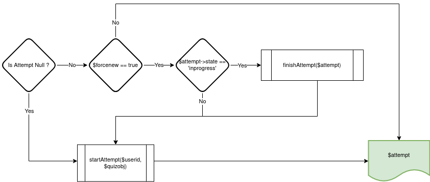

# local_headlessquiz
The primary purpose of this plugin is to facilitate running quizzes on Moodle in 'headless' mode i.e. via webservice calls.

Previously, up to 6 webservice calls were required to just start a single quiz attempt, making this quite difficult. This plugin combines this functionality into a single call, streamlining the process.

## Usage
There is no interface to this plugin, it is interacted with purely via webservices. 

1. Create a quiz via the Moodle interface (see Limitations below)
2. Get the course module ID (from the URL query parameters) 
3. The headless quiz function is attached to the `moodle_mobile_app` webservice, so ensure that it is enabled.
4. Call the webservice: `/webservice/rest/server.php?wstoken=[TOKEN]&wsfunction=local_headlessquiz_get_attempt&cmid=[CMID]&moodlewsrestformat=json` (replacing variables in brackets where necessary)


<details>
<summary><b>Example response from webservice function</b></summary>

```json
{
   "data":{
      "user":{
         "id":18
      },
      "quiz":{
         "id":1,
         "cmid":66,
         "passinggrade":10,
         "questions":[
            {
               "id":2,
               "name":"True or false 1",
               "questiontext":"<p dir=\"ltr\" style=\"text-align: left;\">Is this question true? Select True<br><\/p>"
            },
            {
               "id":3,
               "name":"multiple choice test 1",
               "questiontext":"<p dir=\"ltr\" style=\"text-align: left;\">multiple choice test 1<br><\/p>"
            },
            {
               "id":5,
               "name":"Test3",
               "questiontext":"<p dir=\"ltr\" style=\"text-align: left;\">test<br><\/p>"
            },
            {
               "id":4,
               "name":"Short answer",
               "questiontext":"<p dir=\"ltr\" style=\"text-align: left;\">Short answer<br><\/p>"
            }
         ]
      },
      "attempt":{
         "id":12,
         "state":"finished",
         "timestart":1666065744,
         "timemodified":1666065814,
         "grade":6.0416699999999999,
         "number":5,
         "responses":[
            {
               "questionid":2,
               "state":"gradedright",
               "mark":1,
               "status":"Complete",
               "data":"{\"answer\":\"1\"}"
            },
            {
               "questionid":3,
               "state":"gradedpartial",
               "mark":1.25,
               "status":"Complete",
               "data":"{\"answer\":\"1\"}"
            },
            {
               "questionid":5,
               "state":"gaveup",
               "mark":null,
               "status":"Not answered",
               "data":"{\"_order\":\"12,14,13,11\"}"
            },
            {
               "questionid":4,
               "state":"gaveup",
               "mark":null,
               "status":"Not answered",
               "data":null
            }
         ]
      }
   }
}
```
</details>


### Behaviour
When the function is called the following happens:
- If no attempt exists for the user, a new attempt is started
- If an attempt exists for the user, the attempt is returned

A new attempt can be 'forced' by passing the URL query paramter `forcenew=1`, which will create a new attempt and abandon any existing previous attempts that are `inprogress`



### Calling function relative to a user
The function is called relative to the $USER attached to the webservice token. To call this function for abitrary users, a plugin such as [tool_token](https://github.com/catalyst/moodle-tool_token) can be used.

For example, you can use tool_token to get a token for the user with username `testuser` with the following call:

`/webservice/rest/server.php?wstoken=2bc3138a0323283f481313f5caa6bf3c&wsfunction=tool_token_get_token&moodlewsrestformat=json&idtype=username&idvalue=testuser&service=moodle_mobile_app` 

This returns:

`{"userid":18,"token":"3a8de124dd5a142be6a5cc2ae838231a","validuntil":0}`

It is then possible to call the headless quiz API using this token:

`/webservice/rest/server.php?wstoken=3a8de124dd5a142be6a5cc2ae838231a&wsfunction=local_headlessquiz_get_attempt&cmid=[CMID]&moodlewsrestformat=json`

This will call the `local_headlessquiz_get_attempt` relative to the user attached to the token, `testuser`.

## Limitations
1. Only single page quizzes are supported
2. Only a subset of question types are supported: `shortanswer`, `truefalse`, `multichoice`

## Branches


| Version | Branch            |
|---------|-------------------|
| 4.0     | MOODLE_400_STABLE |

## Installation

Clone the code to your Moodle installation

`git clone git@github.com:catalyst/moodle-local_headlessquiz.git local/headlessquiz`

Run the Moodle upgrade script to install the plugin

`php admin/cli/upgrade.php`

## Contributing and Support
Issues, and pull requests using github are welcome and encouraged!

If you would like commercial support or would like to sponsor additional improvements to this plugin please contact us:

https://www.catalyst-au.net/contact-us


# Credits

This plugin was developed by Catalyst IT Australia:

https://www.catalyst-au.net/


With funding provided by Commerce Tools:

https://commercetools.com/


## License
This program is free software: you can redistribute it and/or modify it under the terms of the GNU General Public License as published by the Free Software Foundation, either version 3 of the License, or (at your option) any later version.

This program is distributed in the hope that it will be useful, but WITHOUT ANY WARRANTY; without even the implied warranty of MERCHANTABILITY or FITNESS FOR A PARTICULAR PURPOSE. See the GNU General Public License for more details.
